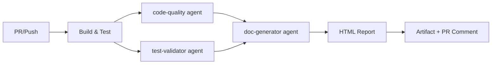

# Agentes Copilot - Guía Completa

Esta carpeta contiene los agentes especializados para la orquestación automática de validación de Pull Requests y commits.

## Estructura

```
.github/agents/
├── doc-generator.agent.md    # Genera documentación HTML de cambios
├── code-quality.agent.md      # Valida mejores prácticas .NET
├── test-validator.agent.md    # Verifica/genera tests unitarios
└── README.md                  # Este archivo
```

## ¿Qué son los agentes?

Son **especializaciones de GitHub Copilot** con instrucciones y contexto específicos para tareas concretas:

| Agente | Propósito | Entrada | Salida |
|--------|-----------|---------|--------|
| **doc-generator** | Documenta cambios en HTML consultable | Diff de PR/commit, test results | HTML con resumen, archivos modificados, tests, cobertura |
| **code-quality** | Revisa calidad, seguridad y mejores prácticas | Archivos modificados (.cs, .csproj) | Markdown con issues categorizados por severidad y tipo |
| **test-validator** | Valida cobertura de tests | Archivos modificados + proyecto xUnit | Markdown con gaps y tests sugeridos |

## Flujo de ejecución



## Cómo funcionan

Los agentes son **invocados por GitHub Actions** (ver [.github/workflows/copilot-pr-validation.yml](../workflows/copilot-pr-validation.yml)):

1. **Trigger**: PR abierto/actualizado o push a `main`
2. **Build/Test**: compilación + xUnit con cobertura
3. **Agentes en paralelo**:
   - `code-quality`: analiza archivos modificados
   - `test-validator`: verifica tests existentes/faltantes
4. **doc-generator**: combina outputs anteriores + diffs en HTML
5. **Publicación**: artifact descargable + comentario en PR

## Uso avanzado

### Extender un agente

Edita el archivo `.agent.md` correspondiente:

```markdown
## Responsabilidades
- ...
- Nueva responsabilidad

## Restricciones
- ...
- Nueva restricción
```

### Añadir nuevo agente

1. Crear `.github/agents/nuevo-agente.agent.md`
2. Definir responsabilidades, restricciones, salida
3. Agregar job en `copilot-pr-validation.yml`
4. Invocar agente con contexto adecuado

### Configurar reportes HTML

El template HTML está inline en el workflow; para personalizar:

1. Editar `generate-html-documentation` job
2. Modificar sección `cat > "$FILENAME" << 'EOF'`
3. Ajustar estilos CSS, secciones, métricas

## Mejores prácticas

✅ **Mantener agentes enfocados**: cada agente una responsabilidad  
✅ **Contexto explícito**: pasar solo datos necesarios a cada agente  
✅ **Salida estructurada**: Markdown/HTML para consumo humano y automatizado  
✅ **Restricciones claras**: evitar que agentes hagan cambios no deseados  
✅ **Lenguaje consistente**: español en todos los reportes (configurable)

## Troubleshooting

**Los agentes no se ejecutan**  
→ Verifica permisos en `.github/workflows/*.yml` (contents, pull-requests, checks)

**Reporte HTML vacío o incompleto**  
→ Revisa logs del job `generate-html-documentation` en Actions

**Tests no aparecen en reporte**  
→ Asegúrate que xUnit compile y ejecute correctamente (`dotnet test`)

**Comentario no aparece en PR**  
→ Verifica token GITHUB_TOKEN tiene permiso `pull-requests: write`

## Recursos

- [GitHub Actions Documentation](https://docs.github.com/actions)
- [GitHub Copilot for Business](https://docs.github.com/copilot)
- [xUnit.net](https://xunit.net/)
- [Coverlet Coverage](https://github.com/coverlet-coverage/coverlet)

---

**Última actualización**: 2026-01-22  
**Versión**: 1.0.0  
**Autor**: GitHub Copilot Agentic Workflow Demo
